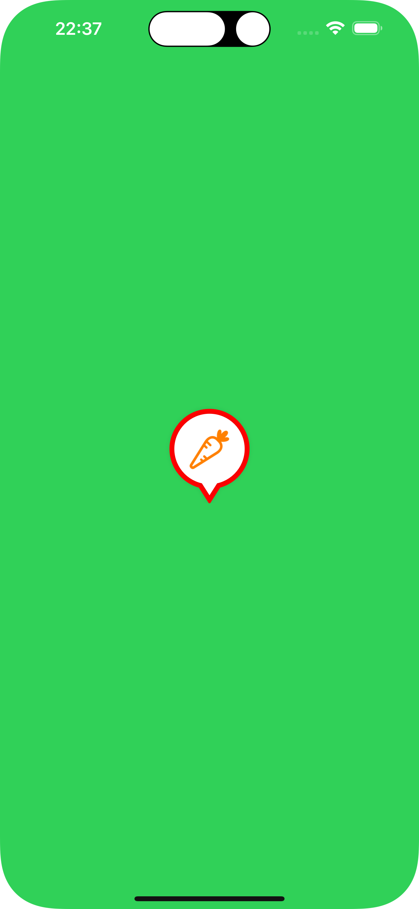

# PinDropViewDemo
Demo app for [PinDropView](https://github.com/OfTheWolf/PinDropView)

<table>
<tr>
<th>Default</th>
<th>Customized</th>
</tr>
  <tr>
    <th></th>
    <th></th>
  </tr>
</table>

## Configuration
```swift
        pinDropView.borderColor = .red
        pinDropView.borderWidth = 10
        pinDropView.fillColor = .white
        pinDropView.icon = .init(systemName: "carrot")!
        pinDropView.iconColor = .orange
        pinDropView.didTapHandler = {
            print("did tap pin")
        }
```


## Installation
### SPM
Add this url in XCode > File > Swift Packages > Add Package Dependency:
```
git@github.com:OfTheWolf/PinDropView.git
```

## Author

uğur, uguboz@gmail.com

## License

PinDropViewDemo is available under the MIT license. See the LICENSE file for more info.
